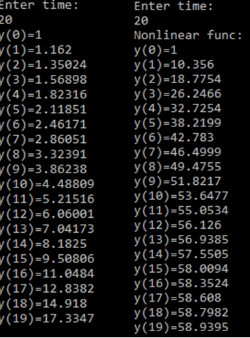
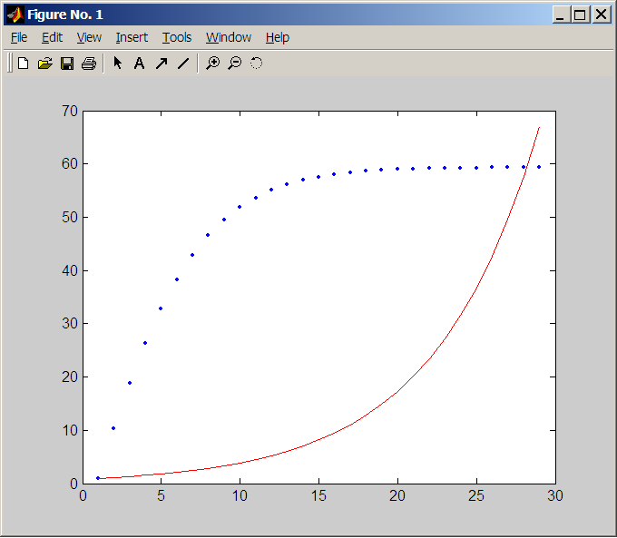

####BSTU
####Department of Informatics and Applied Mathematics
####Laboratory work N1
####Theme: Modeling a control model.
####Studen: Tikhonov D. N.
####Checked By: Ivaniuk D.S.

###Goal
Using C++ create program that model control element using linear and non-linear models
-y(t+1) = 0.988y(t) + 0.232u(t)
-y(t+1) = 0.9y(t) - 0.001y(t-1)^2 + u(t) + sin(u(t-1))
I wrote program in which I enter time and it outputs values of given model at each moment of time:

Graphs(red line represents non-linear system and blue points represent linear):


###Code:
```C++
	#include <iostream>
	#include <math.h>
	using namespace std;


	class Model{	
		public:
			virtual double CalculateY(int t) = 0;
			virtual void Print() = 0;
	};
	class LinearModel : public Model
	{
		
		public:
			double yt[100];
			int size;
			LinearModel() : Model(){}
			double ut(double y){
				return 0.75*y; 
			}
			double CalculateY(int t){
				double y;
				if(t <= 0){
					yt[0] = 1;
					y=1;
					return y;
				}
				else {
					yt[t-1]=this->CalculateY(t-1);
					y = 0.988 * yt[t-1] + 0.232 * this->ut(yt[t-1]);
					yt[t]=y;
					return y;
				}
			}
			void Print()
			{
				cout << "Enter time: " << endl;
				int t;
				cin >> t;
				size=t;
				double y;
				y = this->CalculateY(t);
				for(int i = 0; i < this->size; i++)
					cout << "y(" << i << ")=" << this->yt[i] << endl;
				cout << endl;
			}
	};
	class NonLinearModel : public Model
	{
		
		public:
			double yt[100];
			int size;
			NonLinearModel() : Model() {}
			double ut(double y){
				return 10; 
			}
			double CalculateY(int t){
				double y;
				if(t <= 0){
					y = 1;
					yt[0] = 1;
					return y;
				}
				
				else {
					yt[t-1]=this->CalculateY(t-1);
					y = 0.9 * yt[t-1] - 0.001 * pow(yt[t-2],2) + ut(yt[t-1]) + sin(ut(yt[t-1]));
					yt[t]=y;
					return y;
				}
			}
			void Print()
			{
				cout << "Enter time: " << endl;
				int t;
				cin >> t;
				size=t;
				double y;
				y = this->CalculateY(t);
				cout << "Nonlinear func: " << endl;
				for(int i = 0; i < this->size; i++)
					cout << "y(" << i << ")=" << this->yt[i]  << endl;
			}
	};
	int main()
	{
		Model* m1 = new LinearModel();
		m1->Print();
		Model* m2 = new NonLinearModel();
		m2->Print();
		system("pause");
		return 0;
	}
```
###Conclusion: 
I constructed linear and non-linear models and plotted them. Linear model grows all the time and non-linear grows until some value.
