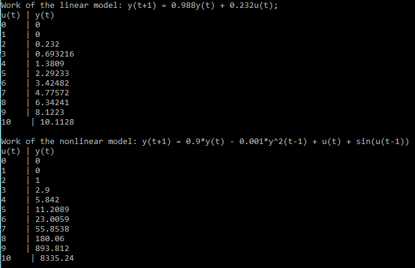
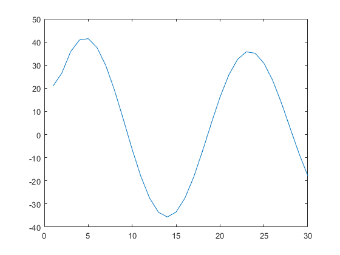
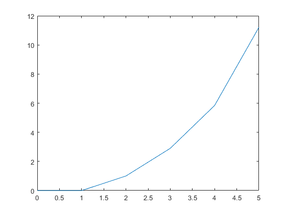

# Лабораторная работа №1 
## Моделирование объекта управления 


Выполнила:  
студентка 3 курса  
группы АС-44, ФЭИС  
Воронко О. А.  
Проверил:   
Иванюк Д. С.

*Цель работы:* Смоделировать объект управления, температура которого описывается уравнением y(τ+1)=a(T)y(τ)+b(T)u(τ). 

Линейная модель: y(t+1)=0.988y(t)+0.232u(t)  
Нелинейная модель: y(t+1)=0.9y(t)-0.001y(t-1)^2+u(t)+sin⁡(u(t-1))  

*Ход работы:*
	На языке С++ реализуем программу, моделирующую рассмотренный выше объект управления, используя линейную и нелинейную модели.  

*Текст программы:*
```
#include<iostream>
#include<stdio.h>
#include<math.h>

using namespace std;
    int u[5];
    double y[5];

class model { // абстрактный класс
    public:
        model (void) {
            cout << "Work of the ";
            for(int t=0; t<=5; t++){
        u[t] = t;}
    }
        // объявление виртуальной функции, общей для линейного и нелинейного классов
        virtual void Abstr (void) = 0;
        ~model() {   // деструктор
        cout << endl;}
};

class linear : public model {  // класс линейной функции
    public:
        linear (void) {
            cout << "linear model: y(t+1) = 0.988y(t) + 0.232u(t);" << endl;
            }
        void Abstr (void) {
            cout << "u(t) | y(t)" << endl;
            y[0] = 0;  // начальное значение  температуры  на входе = 0
            for (int t=0; t<=5; t++) {  // расчет последующих значений температуры по уравнению
        y[t+1] = 0.988*y[t] + 0.232*u[t];
        cout << u[t] << "    | ";
        cout << y[t] << endl;}
            }
        ~linear (){} // деструктор для линейной функции
};

class nonlinear : public model {  // класс нелинейной функции
    public:
        nonlinear (void) {
            cout << "nonlinear model: y(t+1) = 0.9*y(t) - 0.001*y^2(t-1) + u(t) + sin(u(t-1))" << endl;}
        void Abstr (void) {
            cout << "u(t) | y(t)" << endl;
            y[0] = 0; y[1] = 0;  // начальное значение  температуры  на входе = 0
            for(int t=0; t<=5; t++){
        u[t] = t;
    } cout << y[0] << "    | " << u[0]  << endl;
    for (int t=1; t<=5; t++) {  // расчет последующих значений температуры по уравнению
        y[t+1] = 0.9*y[t] + 0.232*y[t-1]*y[t-1] + u[t];
        cout << u[t] << "    | ";
        cout << y[t] << endl; }
        }
        ~nonlinear () {}  // деструктор для нелинейной функции

};

int main () {
    // создание объекта линейного класса
    linear l;
    l.Abstr(); l.~linear();
    // создание объекта нелинейного класса
    nonlinear n;
    n.Abstr(); n.~nonlinear();

    return 0;
}
```

*Результат работы программы:*

 
Построим графики функций в Matlab по полученным точкам.

*Текст команд:*
```
>> u1 = [0; 1; 2; 3; 4; 5];
>> y1 = [0; 0; 0.232; 0.693; 1.381; 2.292];
>> u2 = [0; 1; 2; 3; 4; 5];
>> y2 = [0; 0; 1; 2.9; 5.842; 11.281];
>> plot(u1,y1)
>> plot(u2,y2)
>> plot(u1,y1,'r',u2,y2,'g')
```
*Результат выполнения программы:*  


   
 
*Вывод: *В ходе выполнения лабораторной работы смоделировали объект управления, температура которого описывается уравнением y(τ+1)=a(T)y(τ)+b(T)u(τ). 
