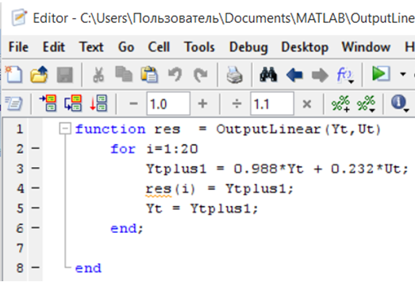
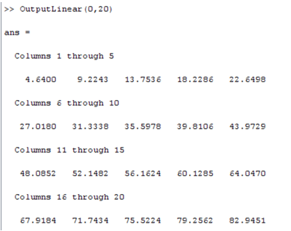
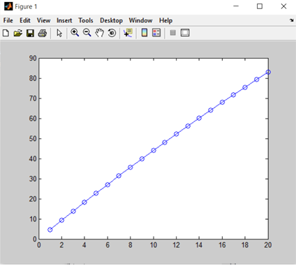
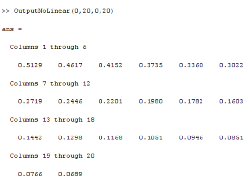
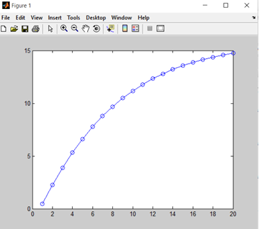

Лабораторная работа №1. 
Моделирование объекта управления.
----------
Выполнила: 
студентка 3 курса 
группы АС-44,ФЭИС 
Маковская К.С. 
Проверил: Пролиско Е.Е. 
------------
*Цель работы:*
------------
Смоделировать объект управления, температура которого описывается 
уравнением y(τ+1)=a(T)y(τ)+b(T)u(τ). 

Линейная модель: y(t+1)=0.988y(t)+0.232u(t)  
Нелинейная модель: y(t+1)=0.9y(t)-0.001y(t-1)^2+u(t)+sin⁡(u(t-1)) 

**Ход работы:**
В MATLAB реализуем программу, моделирующую рассмотренный выше объект управления, 
используя линейную и нелинейную модели. 

**В MATLAB: **

**Функция выводящая изменения по линейной модели:  **

**Функция выводящая изменения по нелинейной модели:  **

**Результат выполнения функций:  **

**График линейной функции:  **

**График нелинейной функции:  **

**Вывод:** реализовала программу в MATLAB, моделирующую рассмотренный выше объект управления, 
 используя эти модели. 
