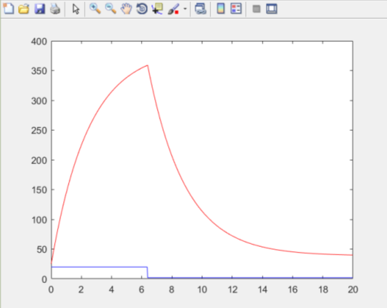
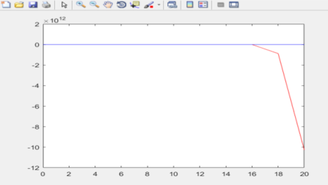

Лабораторная работа № 1
«Моделирование объекта управления» 
----------
Выполнил:
Студент ФЭИС  
3 курса  
Группы АС-44  
Раченя А.В. 
Проверил:  
Поролиско Е.Е.   

------------

### **Цель работы**:  
Моделирование объекта управления, температура которого описывается уравнением y(τ+1)=a(T)y(τ)+b(T)u(τ).  

Линейная модель:  y𝑡+1=0.988𝑦𝑡+0.232𝑢𝑡  
Нелинейная модель:  y𝑡+1=0.9𝑦𝑡−0.001𝑦𝑡−12+𝑢𝑡+sin⁡(𝑢𝑡−1)  

-------------

### **Ход работы:**  
Постоим модели в матлабе и получим результаты.
### **Результат работы программы:**

Линейная модель: 

Нелинейная модель: 

**Вывод:**  
В ходе лабораторной работы я реализовал программу моделирующую рассмотренный объект управления.
