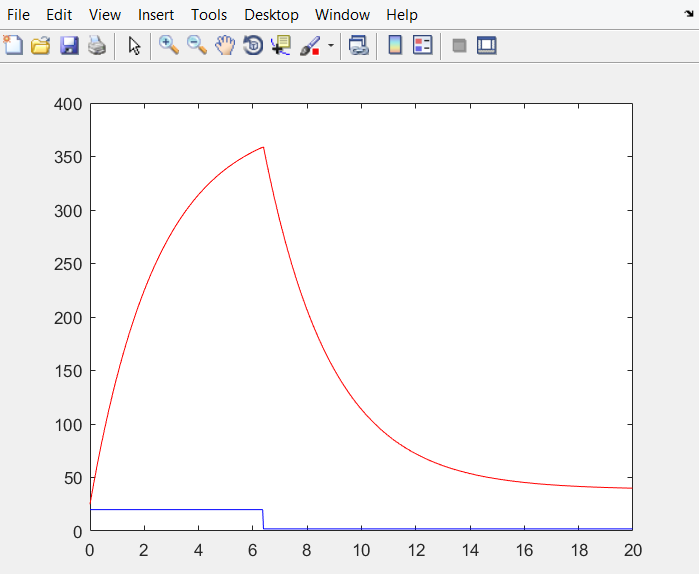
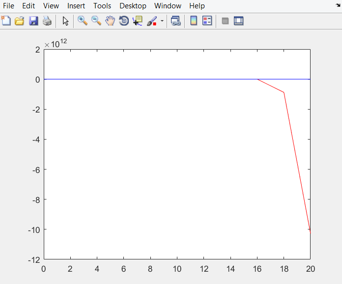

# Лабораторная работа №1 
----------
## Тема: Моделирование объекта управления
----------
 **Выполнил: **
 **Студент ФЭИС **
 **3 курса **
 **Группы АС-44 **
 **Сыч Д.В. **
 **Проверил: **
**Пролиско Е.Е. **

----------
 **Цель работы:** Нaучиться моделировать объекты управления в Matlab.
----------
 **Ход работы:**
 1.  Моделирование объекта управления.
Рассмотрим моделирование объекта, температура которого описывается следующим дифференциальным уравнением: 
**(dy(τ))/dτ=(f(τ))/C+(Y_0-y(τ))/RC **
где τ – время; y(τ) – выходная температура; f(τ)–тепло, поступающее в систему;Y_0 – комнатная температура (для простоты, 
будем считать ее постоянной); C – теплоемкость системы; RC – тепловое сопротивление между границами системы и окружающей средой. Считая величины R и C постоянными, по реакции на единичное ступенчатое воздействие получаем следующее уравнение: 
**y(τ+1)=a(T)y(τ)+b(T)u(τ) **
где τ – дискретное целочисленное время; T – интервал квантования; y(τ)  и u(τ) –вход и выход системы соответственно (выходная температураитепло, поступающее в систему, соответственно).
Получим две модели: линейную (1) и нелинейную(2): 
**1:y_(t+1)=0.988y_t+0.232u_t **
**2:y_(t+1)=0.9y_t-0.001y_(t-1)^2+u_t+sin⁡(u_(t-1)) **

-------------

### **Ход работы:**  
Постоим модели в матлабе и получим результаты.
### **Результат работы программы:**

Линейная модель: 

Нелинейная модель: 

**Вывод:**  
В ходе лабораторной работы я реализовал программу в MATLAB, моделирующую рассмотренный объект управления.

