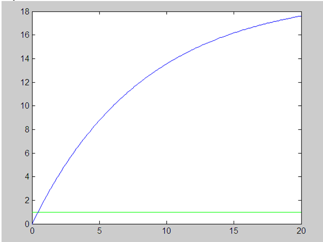
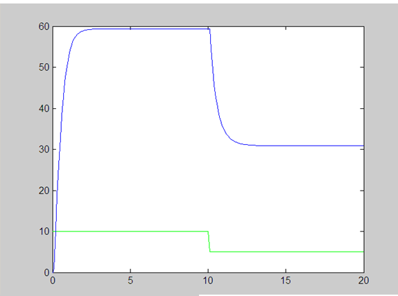

Лабораторная работа № 1
«Моделирование объекта управления»
----------
Выполнила: 
Студентка ФЭИС  
3 курса  
Группы АС-44  
Юхимук Н.Н.  
Проверил:  
Пролиско Е.Е.   

------------

### **Цель работы**:  
Моделирование объекта управления, температура которого описывается уравнением y(τ+1)=a(T)y(τ)+b(T)u(τ).  

Линейная модель:   y(t) = y(t-1)*0.988+0.232*u(t-1)  
Нелинейная модель: y(t+1) = 0.9*y(t) - 0.001*(y(t-1)^2)+u(t)+sin(u(t-1));  

-------------

**Ход работы:**  
 Построение линейной и нелинейной модели в программе matlab:

Линейная модель: 

Нелинейная модель: 

**Вывод:**  
В ходе лабораторной работы реализовала программу,  моделирующую рассмотренный выше объект управления. 
Построила графики используя программу matlab.

